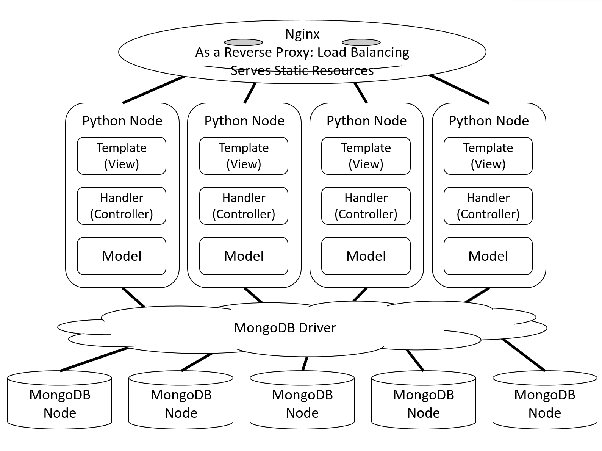
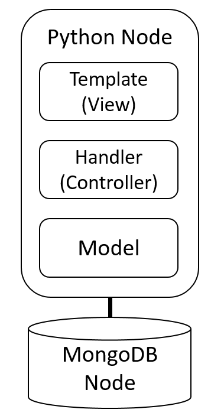
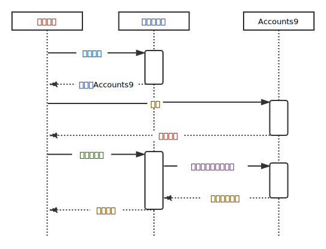
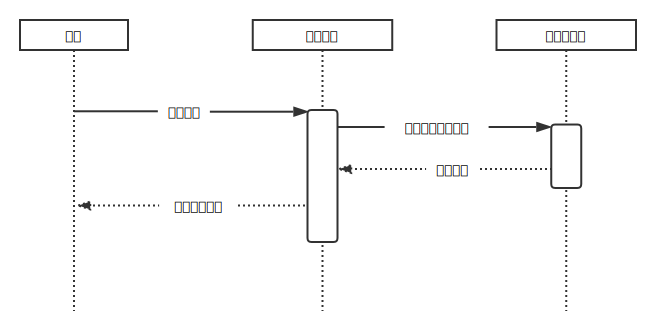
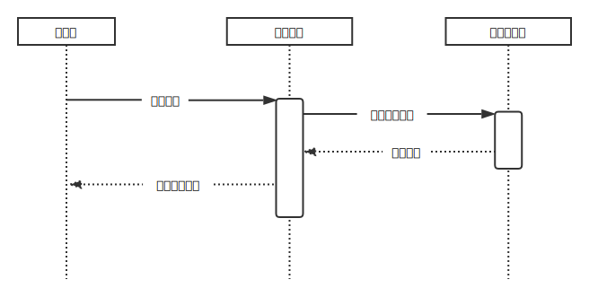
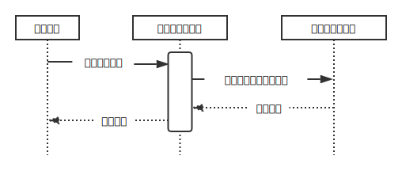
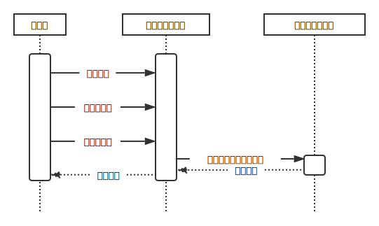
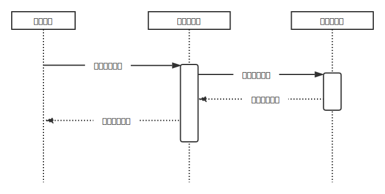
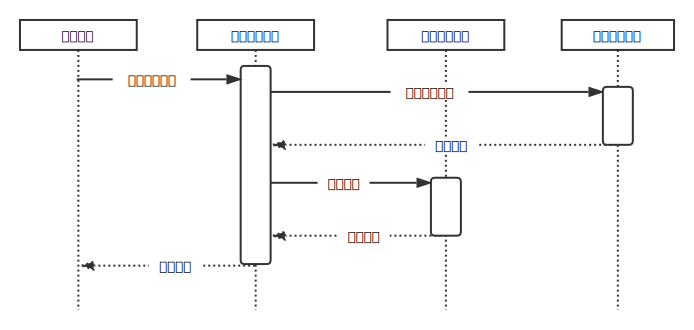

# 体系结构设计

系统体系结构设计如图：

部署时，系统从下到上可分为数据库节点、Python业务节点以及Nginx反向代理节点。数据库节点与Python业务节点通过数据库驱动程序联系起来，支持多对多，可以随意扩展节点数目，有较好的伸缩性。最上层Nginx反向代理节点可代理多个Python业务节点，均衡它们的负载，同时提供静态资源服务，优化性能。

实际开发时，或者简易部署时，可使用上图的模式。系统从下到上可分为数据库节点和Python业务节点，它们直接连接。此时，Python业务节点同时负责处理HTTP请求，包括提供静态资源服务。

## 用户子系统

### 登录流程

系统要求和Accounts9通信，进行用户身份认证。流程如图：

## 赛事报名

### 报名流程

用户发起报名后等待管理员审核完成。流程如图：

### 审核流程

管理员从等待审核的用户中选择用户进行审核。流程如图：

### 修改报名流程

用户修改对某一赛事的报名信息。流程如图：

### 钦点报名流程

管理员替某一个用户对某一赛事发起报名。流程如图：

## 消息子系统

### 发送消息流程

管理员审核赛事后向被审核的用户发送站内消息。流程如图：

## 对于删除操作的处理

出于安全性考虑，本系统在删除赛事、报名、消息或文档等数据库文档时，先将被删除的文档及一些附加数据保存至操作日志集合，然后才进行真正的删除操作。流程如图：

## 文档修订历史

请参见git仓库。