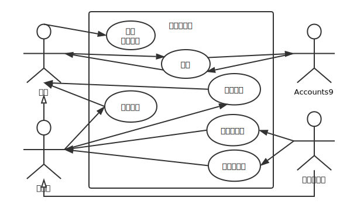
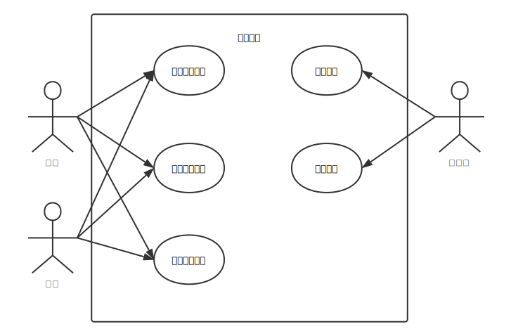
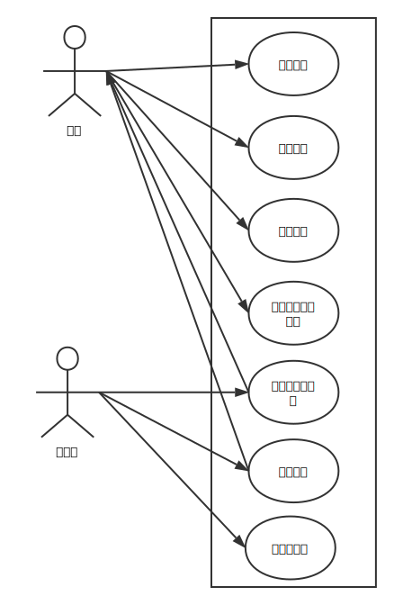
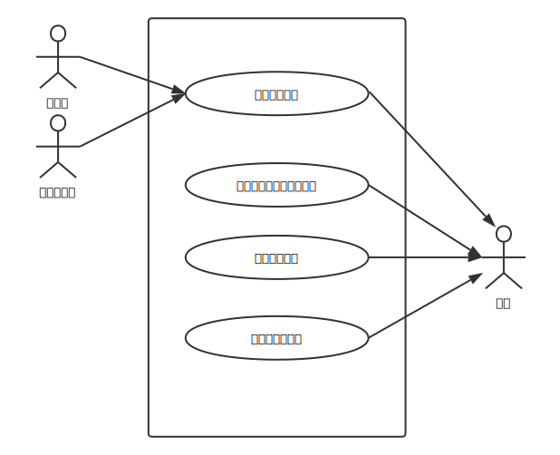
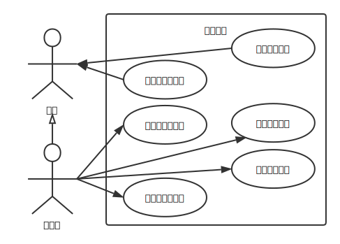

# 需求分析

## 需求概述

### 目标

每年，清华大学举办的“马约翰杯”体育比赛以及清华大学计算机系内举办的“酒井杯”等体育赛事都需要赛前统计报名情况并给予报名人员反馈。目前，问卷星是常用的报名形式。但在很多比赛里，参赛人员需要填写的个人信息完全相同或有大部分重叠，造成不断重复相同工作的情况。同时，组织者给参赛人员回复邮件时，则需要手动添加报名人员邮箱，回复邮件，这项工作单一繁琐，耗费组织人员大量的时间和精力。有时，为了获得特定运动员的报名信息，可能需要大量的中间步骤。

为了改善这一情况，简化报名步骤，提高赛事组织者的工作效率，清华大学计算机系学生会希望建立一个体育赛事报名管理系统，赛事组织者可以在此发布赛事信息及报名通道。同学们可以通过个人info账号信息登录，在赛事报名界面点击报名，自动完成赛事报名。系统将自动收集报名人员的相关信息，并统一进行回复与管理。

该系统所实现的功能将不仅限于系内学生组织，同样适用于校内其他院系以及其他类似体育赛事的报名和管理等场景。

### 运行环境

能够部署、运行在互联网或校园网环境。

### 用户的特点

平台的使用者为清华大学计算机系师生和系学生会体协、体育部成员。

未来将不仅限于计算机系内学生组织，同样适用于校内其他院系师生和系学生会体协、体育部成员。

### 约束条件

10周内完成。

没有经费。

## 总体

系统应包括用户子系统、赛事管理、赛事报名、用户消息提醒以及内容管理模块。

## 用户子系统

用例图如图所示。

### USER-1 用户登录

用户能够通过Accounts9登录系统。

####前置条件

1. Accounts9服务在线
2. 数据库在线
3. 用户合法

#### 触发条件

用户请求登录。

#### 后置条件

1. 系统可识别用户
2. 用户会话在线

#### 正常流程

1. 跳转到Accounts9，用户在Accounts9登录
2. 用户返回到本系统并持有令牌
3. 系统通过令牌换取用户信息
4. 登录成功

### USER-2 用户个人信息修改

用户可以修改自己的个人信息，修改后自动激活。

#### 前置条件

1. 用户已登录

#### 触发条件

用户申请修改自己的个人信息。

#### 后置条件

1. 数据库中用户信息已修改为用户填写的信息
2. 用户已激活

#### 正常流程

1. 用户修改信息
2. 用户点击提交

#### 异常流程

1. 相关信息不符合输入格式，产生ValidationError异常。

### USER-3 管理员添加

超级管理员可以添加管理员。

#### 前置条件

1. 用户已登录
2. 用户已激活
3. 用户为超级管理员角色

#### 触发条件

超级管理员请求添加管理员。

#### 后置条件

1. 相应用户成为管理员

#### 正常流程

1. 超级管理员选择用户
2. 超级管理员确定添加

#### 异常流程

1. 被操作用户为超级管理员，产生异常。

### USER-4 管理员删除

超级管理员可以删除管理员。

#### 前置条件

1. 用户已登录
2. 用户为超级管理员角色

#### 触发条件

超级管理员请求删除管理员。

#### 后置条件

1. 相应用户不再是管理员

#### 正常流程

1. 超级管理员选择已有管理员
2. 超级管理员确定删除

#### 异常流程

1. 被操作用户为超级管理员，产生异常。

## 赛事管理

用例图如图所示。

### EVENT-1 赛事添加

管理员添加赛事，设定赛事相关信息。

####前置条件

用户已登录且拥有管理员权限。

#### 触发条件

管理员在赛事列表页面点击添加赛事，进入赛事添加页面。

#### 后置条件

添加成功的赛事会记录在数据库中，并进入相应的赛事详情页面。

#### 正常流程

1. 管理员在赛事列表页面点击添加赛事

2. 管理员在赛事添加页面编辑赛事相关信息并点击添加赛事按钮

#### 异常流程

管理员编辑赛事的相关信息不符合输入格式，产生ValidationError异常。

### EVENT-2 赛事修改

管理员对已添加赛事的相关信息进行修改。

#### 前置条件

用户已登录且拥有管理员权限，管理员已添加赛事。

#### 触发条件

管理员在赛事详情页面，点击修改赛事进入赛事修改页面。

#### 后置条件

赛事修改成功后会更新数据库数据，并进入相应的赛事详情页面。

#### 正常流程

1. 管理员在赛事详情页面点击修改赛事
2. 管理员修改相应的赛事信息并点击更新赛事按钮

#### 异常流程

管理员编辑赛事的相关信息不符合输入格式，产生ValidationError异常。

### EVENT-3 赛事列表查看

游客和用户可以在赛事列表页面查看所有赛事的简要信息，包括名称，简介和报名开始时间。

#### 前置条件

无

#### 触发条件

游客和用户进入赛事列表页面。

#### 后置条件

无

#### 正常流程

1. 游客和用户点击上方导航栏的赛事按钮查看赛事列表

### EVENT-4 赛事标签搜索

游客和用户可以在赛事列表页面右侧的标签搜索栏输入想要搜索的标签，点击搜索可查看所有包含该标签的赛事。

#### 前置条件

无

#### 触发条件

游客和用户在赛事列表页面右侧的标签搜索栏输入想要搜索的标签，点击搜索。

#### 后置条件

所有包含该标签的赛事以列表形式展现。

#### 正常流程

1. 游客和用户在赛事列表页面右侧的标签搜索栏输入想要搜索的标签
2. 点击搜索

### EVENT-5 赛事详情查看

游客和用户在赛事列表页面或者标签搜索页面点击赛事可以进入详情页面查看赛事所有相关信息。

#### 前置条件

无

#### 触发条件

游客和用户在赛事列表页面或者标签搜索页面点击赛事。

#### 后置条件

游客和用户进入赛事详情页面。

#### 正常流程

1. 游客和用户在赛事列表页面或者标签搜索页面点击赛事

## 赛事报名

用例图如图所示。

### RGS-1 发起报名

用户向某个赛事发起报名。

#### 前置条件

无

#### 触发条件

用户请求向某个赛事发起报名。

#### 后置条件

报名表数据库中新增一条该用户对该赛事的报名。

#### 正常流程

1. 用户填写赛事报名相关信息
2. 用户发起报名
3. 数据库中新增一份报名表

#### 异常流程

用户已对该赛事发起报名，产生DuplicateRegistrationError异常。

### RGS-2 修改报名

用户修改对某个赛事发起的报名。

#### 前置条件

用户已报名该赛事。

#### 触发条件

用户修改报名内容。

#### 后置条件

报名表数据库中对应的报名表内容得到更新。

#### 正常流程

1. 用户获取数据库中已有报名信息
2. 用户修改报名信息
3. 用户提交报名信息
4. 数据库中对应的内容被更新

### RGS-3 删除报名

用户删除向某个赛事发起的报名。

#### 前置条件

用户已报名该赛事。

#### 触发条件

用户请求删除报名。

#### 后置条件

报名表数据库中删除该用户对该赛事的报名。

#### 正常流程

1. 用户请求删除报名
2. 数据库中删除该报名表

### RGS-4 查看用户所有报名

用户查看自己发起的所有报名。

#### 前置条件

无

#### 触发条件

用户请求查看自己发起的报名。

#### 后置条件

返回用户的所有报名并显示。

#### 正常流程

1. 用户请求查看报名
2. 数据库查询该用户发起的报名
3. 返回报名列表并分页显示

### RGS-5 替某个用户报名

管理员替用户向某个比赛发起报名。

#### 前置条件

用户身份为管理员。

#### 触发条件

管理员请求替某个用户向某个赛事报名。

#### 后置条件

报名表数据库中新增一条该用户对该赛事的报名。

#### 正常流程

1. 管理员选择赛事
2. 管理员选择用户
3. 管理员填写报名信息并提交
4. 数据库中新增该用户的报名表

### RGS-6 审核报名

管理员审核用户的比赛报名。

#### 前置条件

用户身份为管理员。

#### 触发条件

管理员审核若干用户的报名。

#### 后置条件

报名数据库中更新用户审核状态。

#### 正常流程

1. 管理员选择赛事
2. 管理员选择用户
3. 管理员设置审核结果
4. 数据库中更新用户审核状态

### RGS-7 导出报名表

管理员导出比赛的报名表。

#### 前置条件

用户身份为管理员。

#### 触发条件

管理员导出比赛的报名表。

#### 后置条件

返回比赛的报名表。

#### 正常流程

1. 管理员选择赛事
2. 管理员定制报名表
3. 管理员下载报名表

## 用户消息提醒

用例图如图所示。

### MSG-1 发送站内消息 

管理员直接向用户发送站内消息，或者审核子系统在审核完成时自动向用户发送站内消息。

#### 前置条件 

用户为管理员角色。

#### 触发条件

管理员或者审核子系统请求发送站内消息

#### 后置条件

消息数据库中添加一条当前发送的消息

#### 正常流程

1. * 管理员选择收信用户，编辑消息，请求发送消息
   * 审核子系统根据被审核用户和审核结果，自动生成站内信，请求发送消息

2. 消息数据库中添加一条当前发送的消息

### MSG-2 查询全部消息、未读消息

用户请求全部消息或者未读消息的列表并分页显示

#### 前置条件

用户已登录。

#### 触发条件

用户请求显示全部消息或者未读消息

#### 后置条件

返回满足条件的消息列表并显示

#### 正常流程

1. 用户请求全部消息列表或者未读消息列表

2. 数据库查询所有收信人为请求用户的，是否已读状态满足要求的消息列表

3. 将消息分页显示

### MSG-3 查看消息详情 

用户请求查看收件人为自己的某条消息的详情内容

#### 前置条件

用户已登录。

#### 触发条件

用户请求查看收件人为自己的某条消息

#### 后置条件

返回该消息的详情内容并显示，将该消息的阅读情况设为已读

#### 正常流程

1. 用户请求收件人为自己的某条消息

2. 数据库中根据ID找到那条消息并设为已读

3. 返回消息详情并显示

#### 异常流程

用户请求的消息已被删除，产生MessageNotFoundError异常

### MSG-4 显示未读消息数

更新显示用户的未读消息数

#### 前置条件

用户已登录。

#### 触发条件

用户删除消息或者消息阅读情况被更改

#### 后置条件

显示用户最新的未读消息数

#### 正常流程

1. * 用户删除某条消息
   * 用户阅读了某条未读消息，导致消息阅读情况被更改

2. 重新从数据库中获取当前用户的未读消息数，并重绘页面

## 内容管理

用例图如图所示。

### DOC-1 查看优秀运动员

用户可以查看优秀运动员。

#### 前置条件

1. 数据库在线

#### 触发条件

用户请求查看优秀运动员。

#### 后置条件

1. 用户看到了优秀运动员

#### 正常流程

1. 读取数据库
2. 显示优秀运动员

#### 异常流程

1. 优秀运动员不存在，产生异常。

### DOC-2 添加优秀运动员

管理员可以添加优秀运动员。

#### 前置条件

1. 用户已登录
2. 用户已激活
3. 用户为管理员角色

#### 触发条件

管理员请求添加优秀运动员。

#### 后置条件

1. 新的优秀运动员已被写入数据库

#### 正常流程

1. 管理员填写优秀运动员信息
2. 写入数据库

#### 异常流程

相关信息不符合输入格式，产生ValidationError异常。

### DOC-3 修改优秀运动员

管理员可以修改优秀运动员。

#### 前置条件

1. 用户已登录
2. 用户已激活
3. 用户为管理员角色

#### 触发条件

管理员请求修改优秀运动员。

#### 后置条件

1. 优秀运动员信息已更新到数据库

#### 正常流程

1. 管理员修改优秀运动员信息
2. 更新数据库

#### 异常流程

1. 相关信息不符合输入格式，产生ValidationError异常。
2. 优秀运动员不存在，产生异常。

### DOC-4 查看系代表队

用户可以查看系代表队。

#### 前置条件

1. 数据库在线

#### 触发条件

用户请求查看系代表队。

#### 后置条件

1. 用户看到了系代表队

#### 正常流程

1. 读取数据库
2. 显示系代表队

#### 异常流程

1. 系代表队不存在，产生异常。

### DOC-5 添加系代表队

管理员可以添加系代表队。

#### 前置条件

1. 用户已登录
2. 用户已激活
3. 用户为管理员角色

#### 触发条件

管理员请求添加系代表队。

#### 后置条件

1. 新的系代表队已被写入数据库

#### 正常流程

1. 管理员填写系代表队信息
2. 写入数据库

#### 异常流程

相关信息不符合输入格式，产生ValidationError异常。

### DOC-6 修改系代表队

管理员可以修改系代表队。

#### 前置条件

1. 用户已登录
2. 用户已激活
3. 用户为管理员角色

#### 触发条件

管理员请求修改系代表队。

#### 后置条件

1. 系代表队信息已更新到数据库

#### 正常流程

1. 管理员修改系代表队信息
2. 更新数据库

#### 异常流程

1. 相关信息不符合输入格式，产生ValidationError异常。
2. 系代表队不存在，产生异常。

## 文档修订历史

请参见git仓库。
